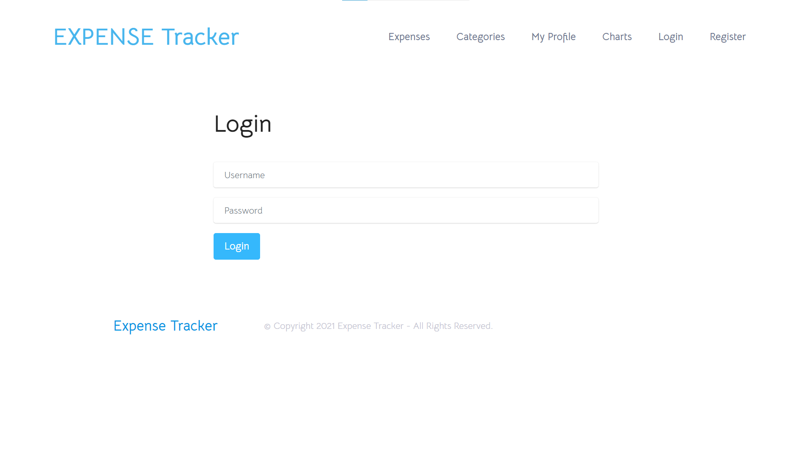
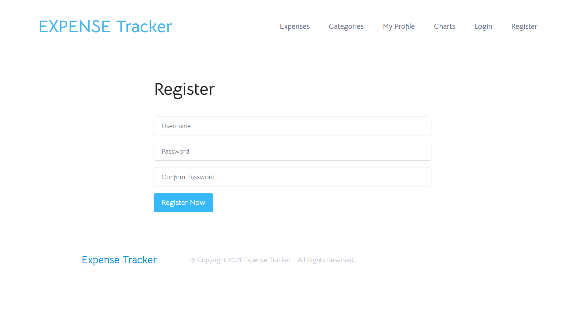
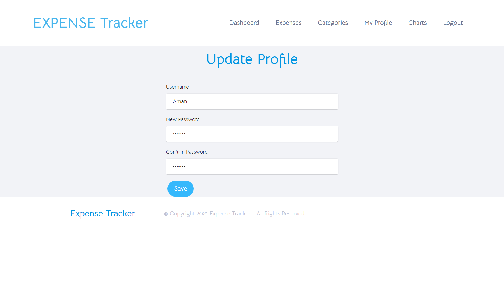
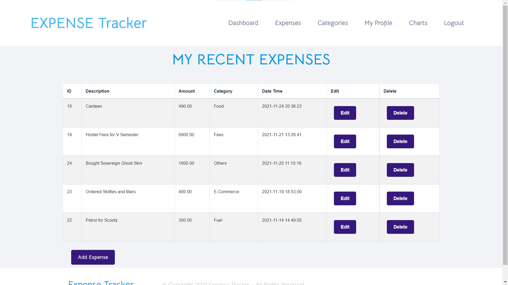
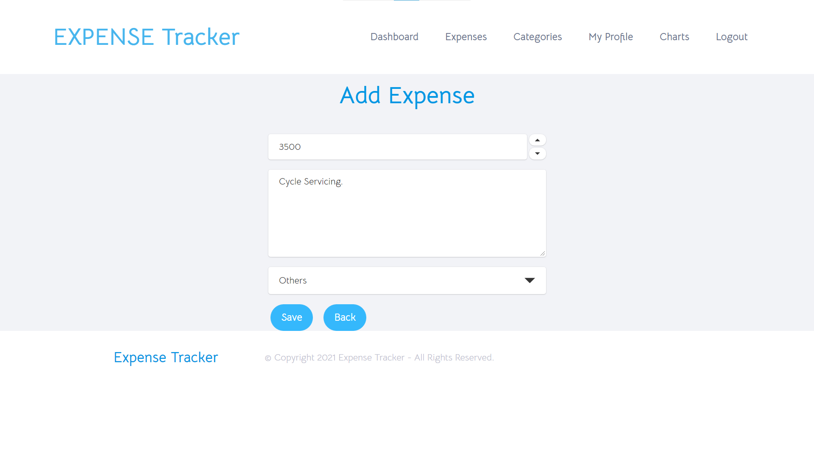
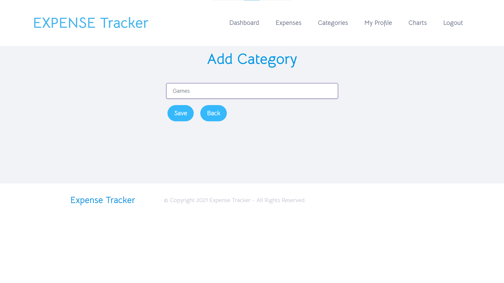
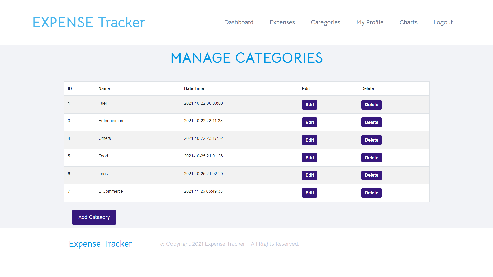
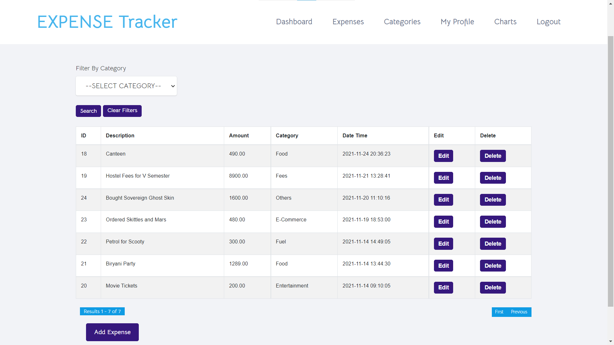
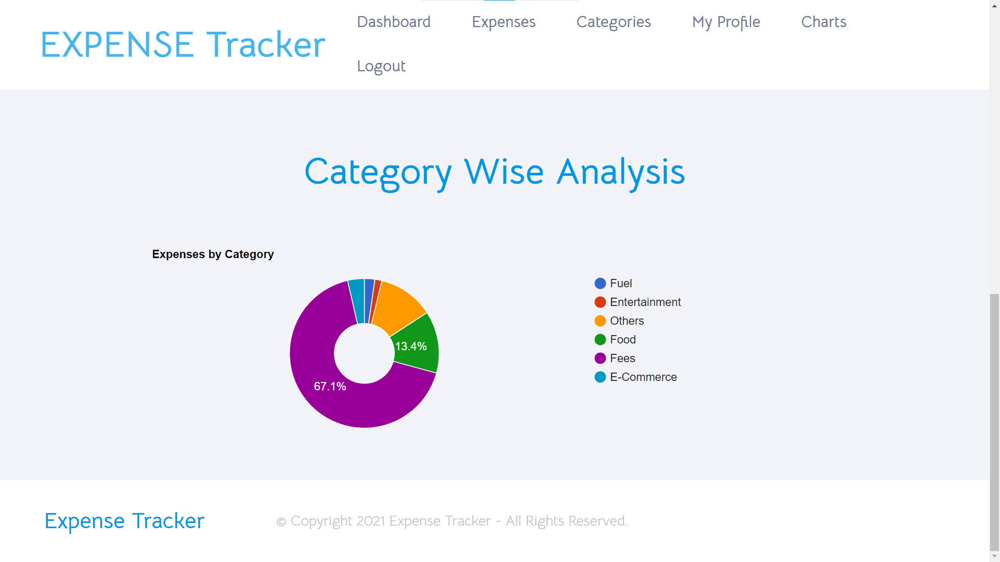
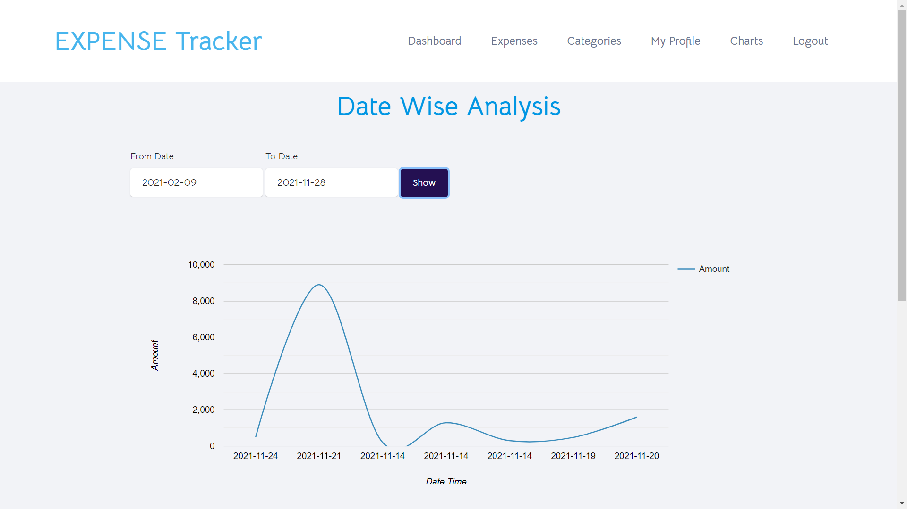

## Modules and Screenshots
The Screenshots of all the webpages are as follows:

### Login Page
<p align="center">

</p>

### Register Page
<p align="center">

</p>

### Update Profile Page
<p align="center">

</p>

### Expense Dashboard
<p align="center">

</p>

### Add New Expense
<p align="center">

</p>

### Add New Category
<p align="center">

</p>

### Manage Categories
<p align="center">

</p>

### Manage Expenses
<p align="center">

</p>

**Query**
```sql
SELECT 
  E.*, 
  C.name as category_name 
FROM 
  expenses E 
  LEFT JOIN categories C ON E.category_id = C.id 
WHERE 
  user_id = $user_id;
```
  
### Category Wise - Pie Chart
<p align="center">

</p>

**Query**
```sql
SELECT 
  sum(E.amount) as total_expenses, 
  C.name 
FROM 
  expenses E 
  LEFT JOIN categories C ON E.category_id = C.id 
WHERE 
  E.user_id = $user_id 
GROUP BY 
  E.category_id;
```

### Date and Time Wise - Line Chart
<p align="center">

</p>

**Query**
```sql
SELECT * 
FROM 
  expenses 
WHERE 
  datetime_added >= '$from_date' AND datetime_added <= '$to_date' 
  AND user_id = $user_id;
```