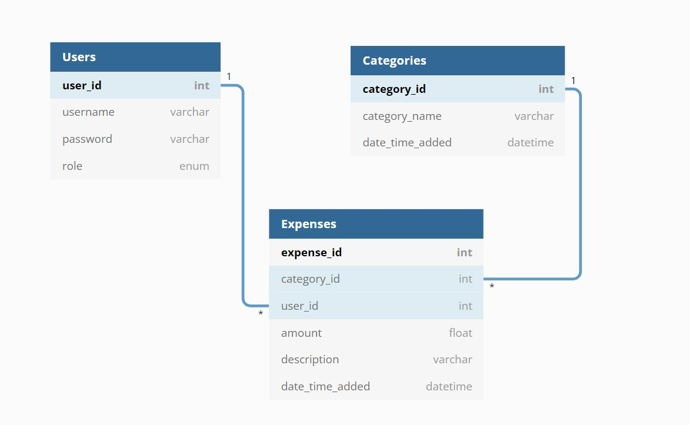

<div id="top"></div>

<!-- Project Logo -->
<div align="center">
    <a href="https://github.com/azileify/Expense-Tracker">
        
    </a>
    <h3 align="center"><b><i>EXPENSE TRACKER</i></b></h3>
    <p align="center">
        Simple Personal Expense Tracker💸with User Login👥and Data Visualization 📊.
        <br /><a href="https://github.com/azileify/Expense-Tracker/blob/main/README.md"><strong>Explore the docs »</strong></a>
    </p>
</div>

<!-- Table of Contents -->
<details>
  <summary><b>Table of Contents</b></summary>
  <ol style="font-weight: bold">
    <li>
        <a href="#about-the-project" style="color: #FFF"><b>About the Project</b></a>
    </li>
    <li>
        <a href="#built-with" style="color: #FFF"><b>Built With</b></a>
        <ul style="list-style-type: disc">
            <li><a href="#tech-stack">Tech Stack</a></li>
            <li><a href="#framework-and-packages">Framework and Packages</a></li>
            <li><a href="#editors">IDEs/Editors</a></li>
        </ul>
    </li>
    <li>
        <a href="#database" style="color: #FFF"><b>Database</b></a>
        <ul style="list-style-type: disc">
            <li><a href="#relations">Relations</a></li>
            <li><a href="#er-diagram">ER Diagram</a></li>
            <li><a href="#schema">Schema</a></li>
        </ul>
    </li>
    <li>
        <a href="#getting=started" style="color: #FFF"><b>Getting Started</b></a>
        <ul style="list-style-type: disc">
            <li><a href="#rrerequisites">Prerequisites</a></li>
            <li><a href="#how-to-run">How to Run</a></li>
        </ul>
    </li>
    <li>
        <a href="#usage" style="color: #FFF"><b>Usage</b></a>
    </li>
    <li>
        <a href="#license" style="color: #FFF"><b>License</b></a>
    </li>
    <li>
        <a href="#acknowledgments" style="color: #FFF"><b>Acknowledgments</b></a>
    </li>
</details>

<!-- About the Project -->
## About the Project


<p>A simple website to track daily <b>Personal Expenses.</b>
The Website supports <b>User Login/Registration</b> and can <b>Categorizes Expenses</b>. The Charts section will /<b>Visualize Expenses Data</b> based on both <b>Categories</b> and <b>Over a Period of Time.</b></p>

> Project created for <b>Database Management Systems Lab (CS309)</b> course.

<p align="right">(<a href="#top">back to top</a>)</p>

<!-- Built With -->
## Built With

<p>Set of Programming Languages, Frameworks and Tools used for creating the Project are listed below ⤵︎</p>

### Tech Stack

<ul>
    <p align="center">
        
        
        
        
    </p>
    <li><b><a href="https://www.apachefriends.org/index.html" style="color: #FFF">XAMPP</a>:</b> Open-Source Cross Platform Web Solution Stack Package which provides
    <ol style="list-style-type: number">
        <li><b><a href="https://httpd.apache.org/" style="color: #FFF">Apache HTTP Server</a>:</b> Free and Open-source Web Server that delivers web content through the internet.</li>
        <li><b><a href="https://www.php.net/" style="color: #FFF">PHP</a>:</b> General-Purpose Scripting Language for Web Development.</li>
        <li><b><a href="https://www.mysql.com/" style="color: #FFF">MySQL</a>:</b> Free and Open-Source Relational Database Management System (RDBMS).</li>
    </ol>
    </li>
    <br>
    <p align="center">
        
        
        
        
    </p>
    <li><b>HTML 5</b>: Standard Markup Language for creating Web Pages.</li>
    <li><b>CSS</b>: Used to Style HTML Pages.</li>
    <li><b>Javascript</b>: Used for Scripting Web Pages.</li>
</ul>

### Framework and Packages

<ul>
    <li><b><a href="https://symfony.com/" style="color: #FFF">Symfony</a>:</b> An open-source PHP Web-Application Framework, designed for developers who need a simple and elegant toolkit to create full-featured web applications.
    <p align="left">
        
    </p>
    </li>
    <li><b><a href="https://symfony.com/doc/current/doctrine.html" style="color: #FFF">Doctrine- DBAL</a>:</b> Powerful PHP Database Abstraction Layer with many for features for communication between a Computer Application and Relational Databases like MySQL, PostgreSQL, Oracle and SQLite.
    </li>
    <li><b><a href="https://github.com/PHPMailer/PHPMailer" style="color: #FFF">PHPMailer</a>:</b> A full-featured email creation and transfer class for PHP. Used for Registration Confirmation Mail 
    <strong>(Removed for Current Version).</strong>
    </li>
</ul>

### Editors

<p>Integrated development environments (IDEs) are used to manage workflows, access a suite of development tools within a single dashboard, and reduce errors.</p>

Editors used are ⤵︎
<ul>
    <p align="center">
        
        
        
    </p>
    <li><b><a href="https://code.visualstudio.com/" style="color: #FFF">Visual Studio Code</a>:</b> Free, powerful, lightweight code editor, highly customizable with over 25,000 extensions for every Programming Language.</li>
    <li><b><a href="https://www.jetbrains.com/phpstorm/" style="color: #FFF">PHPStorm</a>:</b> Editor for PHP, HTML and JavaScript with on-the-fly code analysis, error prevention and automated refactorings for PHP and JavaScript code.</li>
    <li><b><a href="https://www.vim.org/" style="color: #FFF">VIM</a></b>: Blazing fast commands from VIM are installed using open-source extensions in both editors.
</ul>

<p align="right">(<a href="#top">back to top</a>)</p>

<!-- Database -->
## Database

### Relations

The Database has three Tables:
<ol>
    <li>
    <p><b>👥 Users (user_id, role, username, password, registered_date_time): </b> Stores credentials for registered users.</p>
    </li>
    <li>
    <p><b>🏷️ Category (category_id, category_name, date_time_added):</b> Stores different types of categories.</p>
    </li>
    <li>
    <p><b>💸 Expenses (expense_id, user_id, category_id, amount, description, date_time_added):</b> Stores Expense details like amount and description for each user.</p>
    </li>
</ol>

### ER-Diagram

The Entity-Relationship Diagram for the Database is:
<p align="center">
    
</p>

### Schema

The Class Diagram for the Database is:
<p align="center">
    
</p>

<p align="right">(<a href="#top">back to top</a>)</p>

<!-- Getting Started -->
## Getting Started
<p>The Prerequisites and Installation Process is given below ⤵︎</p>

### Prerequisites
<p> XAMPP v7.3.12 has been used for the Web Services. The installer for the suggested version can be downloaded from SourceForge. 
<a href="https://sourceforge.net/projects/xampp/files/XAMPP%20Windows/7.3.12/"> Click Here</a>
</p>

### How to Run ?
1. Clone this repo using the command

    ```sh
    git clone https://github.com/azileify/Expense-Tracker.git
    ```
2. Move the repo to htdocs folder located under XAMPP Installation Folder. The Default Path is: ```C:\xampp\htdocs```.
3. Open XAMPP Control Panel and then start Apache Server and MySQL services.
4. Open PHPmyAdmin and then create a Database of name **Expense_Tracker** and import the ```Expense_Tracker.sql``` file provided in database folder in the repo.
5. Now use the address ```localhost/Expense-Tracker``` to open the project in browser.

<p align="right">(<a href="#top">back to top</a>)</p>

<!-- Screenshots -->
## Usage

<p align="right">(<a href="#top">back to top</a>)</p>

<!-- License -->
## License
This software is licenced under the MIT License. Please read [LICENSE](https://github.com/azileify/Expense-Tracker/blob/main/LICENSE) for information on the software availability and distribution.

<p align="right">(<a href="#top">back to top</a>)</p>

<!-- Acknowledgments -->
## Acknowledgments

<p align="right">(<a href="#top">back to top</a>)</p>